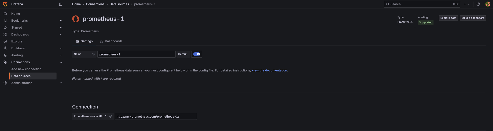
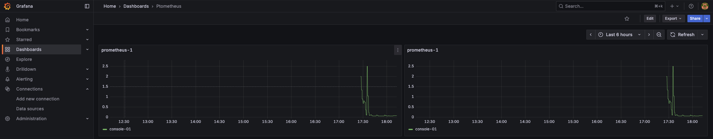
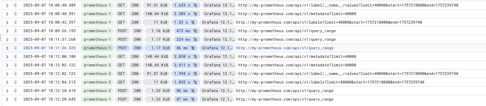

# Setup Grafana VM

## Access VM

SSH to VM `console-01`

## Install Docker

```bash
curl -fsSL https://get.docker.com | sudo bash
```

## Run Grafana

```bash
docker run -d -p 3000:3000 --name=grafana grafana/grafana-oss
```

Access Grafana UI: `http://<VM_EXTERNAL_IP>:3000`

## Setup Datasource

Datasource 1:
- Prometheus server URL: `my-prometheus.com/prometheus-1`

Datasource 2:
- Prometheus server URL: `my-prometheus.com/prometheus-2`

## Screenshots

Setup prometheus datasource.



Create dashboard.



Check Cloud Run logs.



## Conclusion

In this lab, we can confirm the Grafana Prometheus data source is working with setting the Prometheus server URL with additional path.

With the additional path, we can leverage the Serverless NEG URL mask to route the traffic to different Cloud Run services.

We can give different permissions to different Cloud Run services to access different GCP Project Monitoring data.

If we have multiple GCP Projects, we can setup a central Grafana VM to collect and visualize the monitoring data from different GCP Projects. Just add new Cloud Run service and setup new datasource in Grafana.
